# Goiás EC — App do Torcedor

Aplicativo (não-oficial, em desenvolvimento) do ecossistema digital do torcedor esmeraldino: acompanhar jogos e classificação, comprar ingresso com check-in na entrada, virar Sócio Esmeralda, comprar na loja oficial, jogar na Arena Esmeraldina e seguir as redes do clube — tudo num só lugar.

| | |
|---|---|
| **App** | Flutter (Android, iOS, Web) — PT-BR, EN e ES |
| **Backend esportivo/social** | Cloudflare Worker (TypeScript) |
| **Backend de conta e conteúdo** | Supabase (Auth + Postgres) |

<p align="center">
  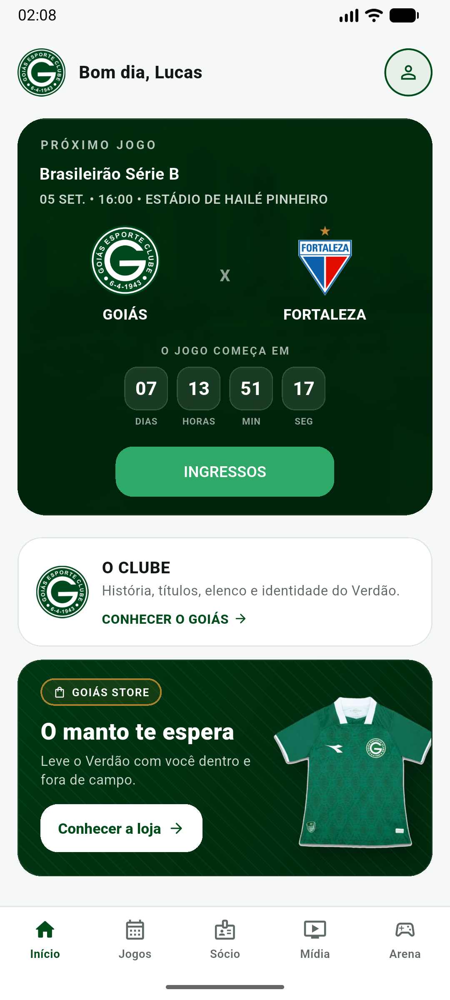
  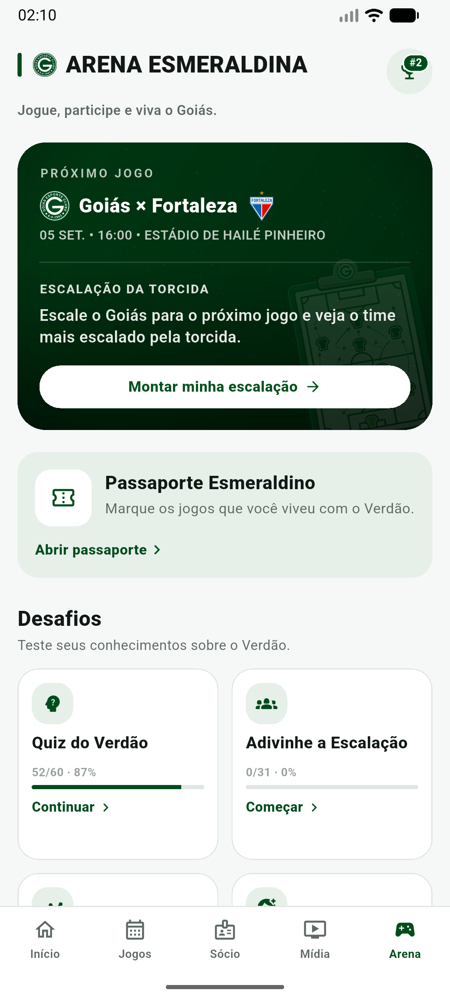
  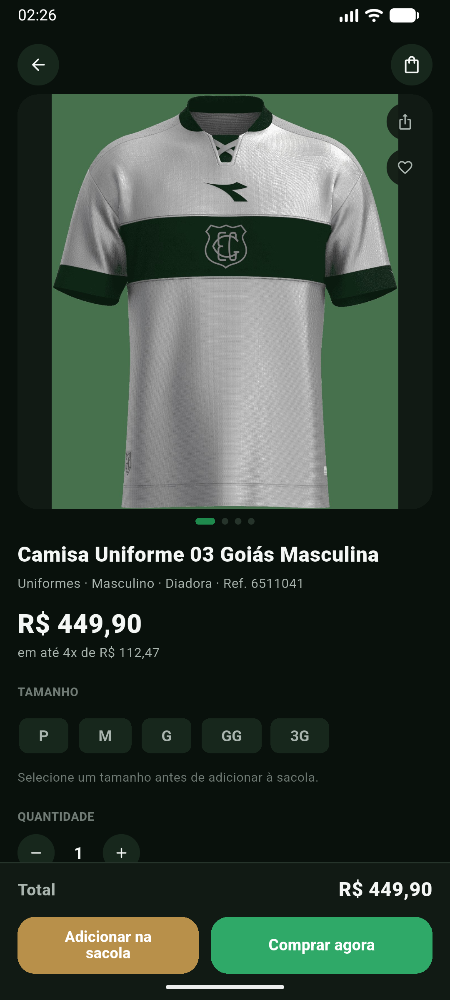
  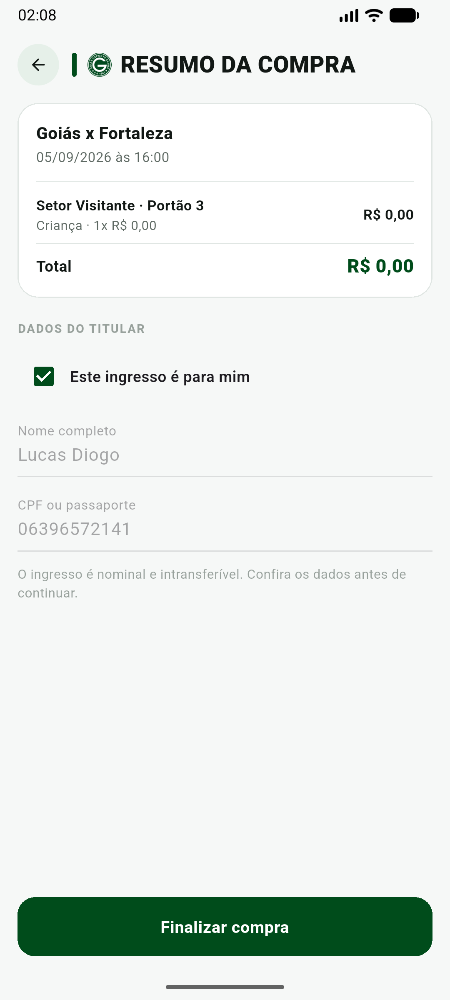
</p>

## Índice

- [Início](#início)
- [Jogos](#jogos)
- [Notícias e Mídia](#notícias-e-mídia-goiás-na-rede)
- [Sócio Esmeralda](#sócio-esmeralda)
- [Ingressos](#ingressos)
- [Loja](#loja-goiás-store)
- [Arena Esmeraldina](#arena-esmeraldina)
- [O Clube](#o-clube)
- [Conta e Perfil](#conta-e-perfil)
- [Idiomas e tema](#idiomas-e-tema)
- [Arquitetura](#arquitetura)
- [Backend (Cloudflare Worker)](#backend-cloudflare-worker)
- [Backend (Supabase)](#backend-supabase)
- [Rodando o projeto](#rodando-o-projeto)
- [Testes e qualidade](#testes-e-qualidade)

## Início

- Saudação personalizada e card de contagem regressiva para a próxima partida do Goiás, com atalho direto pra compra de ingresso.
- Destaque dinâmico da Arena Esmeraldina: convida pra votar na Escalação da Torcida quando há votação aberta, pro Quiz quando ainda não foi concluído, ou pro hub da Arena como padrão — sempre levando pro hub, nunca direto pra um jogo específico.
- Cards de entrada para O Clube e para a Goiás Store.

<p align="center"></p>

## Jogos

- **Partidas**: próximo jogo do Goiás com data, horário e estádio; rodada atual (todos os jogos, com navegação pras rodadas anteriores/seguintes) e resultados recentes.
- **Classificação**: tabela completa da Série B, com o Goiás destacado.
- **Detalhes da partida**: placar, timeline de eventos e escalações titulares de cada jogo.

<p align="center">
  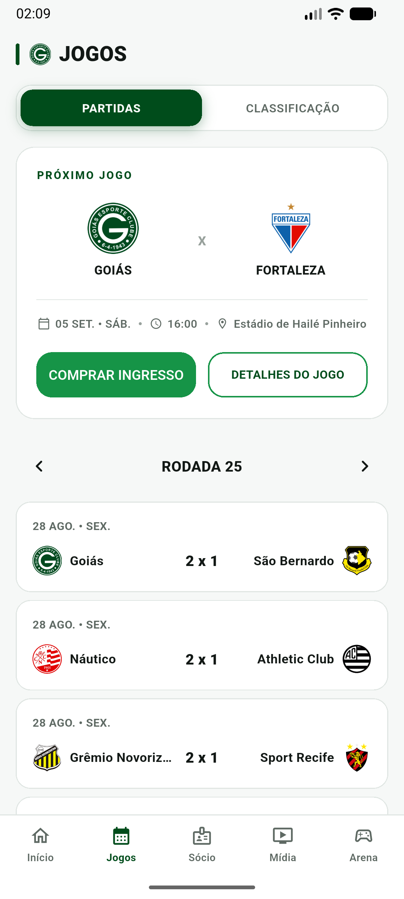
  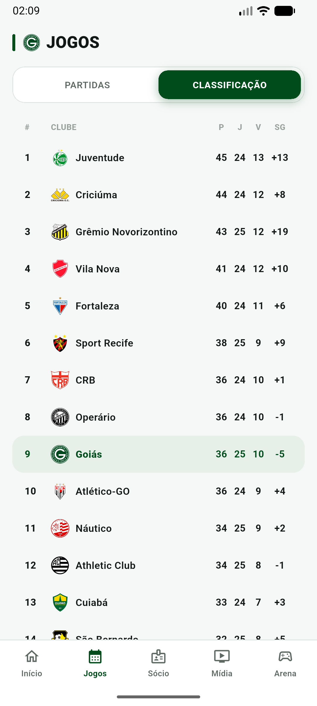
</p>

## Notícias e Mídia (Goiás na Rede)

- Leitor nativo de matérias do clube (backend próprio de scraping), com visualizador de PDF embutido para links de press kit — nunca sai do app.
- Feed unificado de **Instagram**, **YouTube** e **X**, com filtro por plataforma.

<p align="center">
  
  
</p>

## Sócio Esmeralda

- Vitrine com os planos oficiais em carrossel, cada um com página de detalhes e benefícios.
- Associação real: assinatura de 30 dias persistida no Supabase (substituiu o repositório mock inicial).
- Regulamento completo e Dúvidas Frequentes, servidos pelo Supabase com fallback local se a tabela estiver vazia ou sem rede.

<p align="center">
  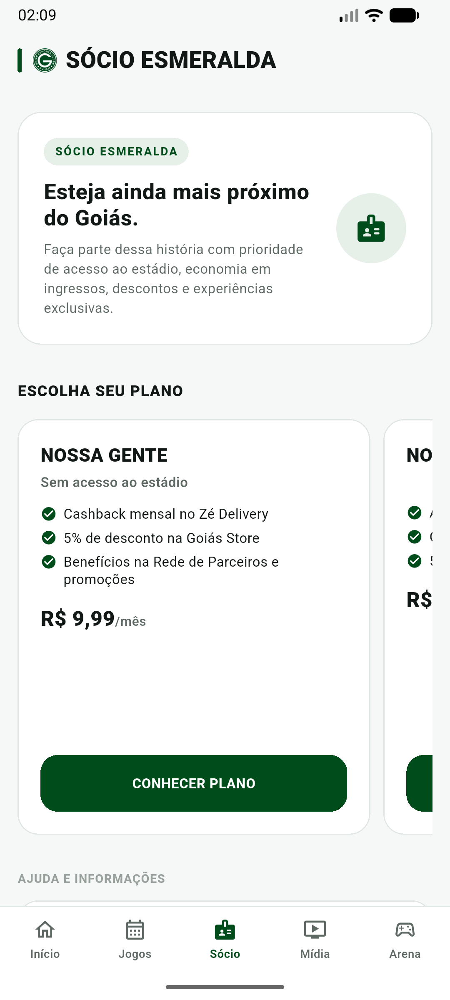
  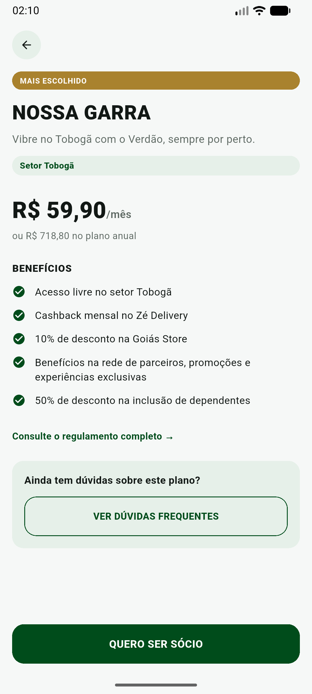
</p>

## Ingressos

- Setores do estádio disponíveis por partida, com seleção de quantidade e tipo (inteira/meia/menor).
- Resumo de compra com dados do titular e confirmação — venda persistida no Supabase.
- Check-in na entrada do estádio no dia do jogo, com PDF do ingresso gerado no próprio app.
- "Meus ingressos" (em aberto/histórico) e "Meus pedidos".

<p align="center">
  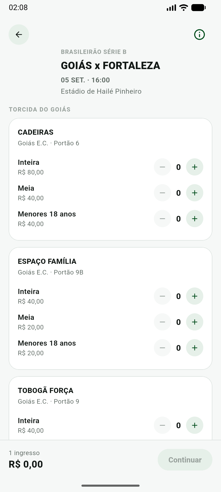
  
</p>

## Loja (Goiás Store)

Duas abas dentro da mesma tela: **Ingressos** (atalho pro matchday e pras compras já feitas) e **Roupas** (a vitrine em si).

- Catálogo real com mais de 100 produtos (uniformes, acessórios, presentes), organizado por categoria.
- Carrinho, checkout e histórico de pedidos completos — hoje sobre um repositório local, pronto pra plugar um gateway de pagamento real sem reescrever telas.

<p align="center"></p>

## Arena Esmeraldina

Hub de minigames sobre a história e o elenco do Goiás, com progresso e ranking persistentes no Supabase.

| Jogo | Descrição |
|---|---|
| **Escalação da Torcida** | Vote na escalação provável do próximo jogo e veja o time mais escalado pela torcida. |
| **Quiz do Verdão** | Perguntas sobre a história do clube, em três níveis de dificuldade. |
| **Adivinhe a Escalação** | Reconstrua as escalações de partidas históricas do Goiás. |
| **Adivinhe o Jogador** | Descubra o jogador pela trajetória de carreira (clubes, jogos, gols). |
| **Quem Vestiu o Manto?** | Jogador secreto revelado aos poucos por foto e pistas. |
| **Passaporte Esmeraldino** | Registre os jogos que você viveu com o Goiás, temporada a temporada. |

Tudo isso alimenta um **ranking cruzado entre os jogos** (geral/mensal/semanal), com detalhamento de pontuação por jogo para cada torcedor.

<p align="center">
  
  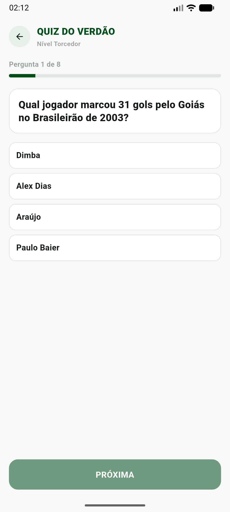
  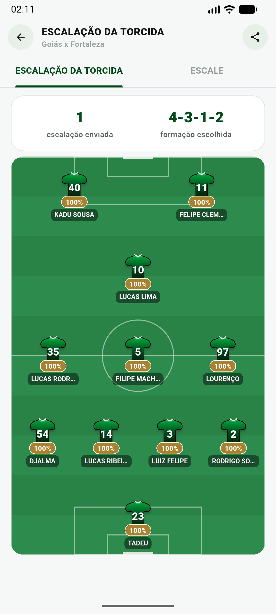
</p>
<p align="center">
  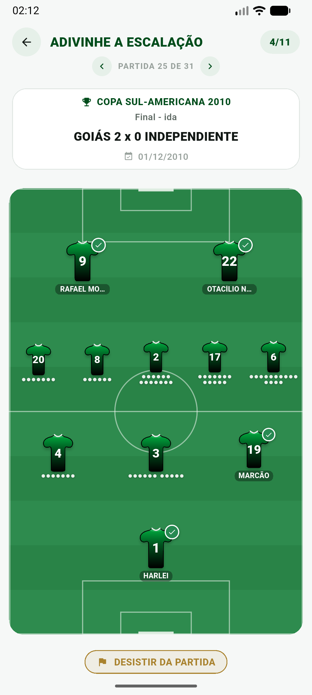
  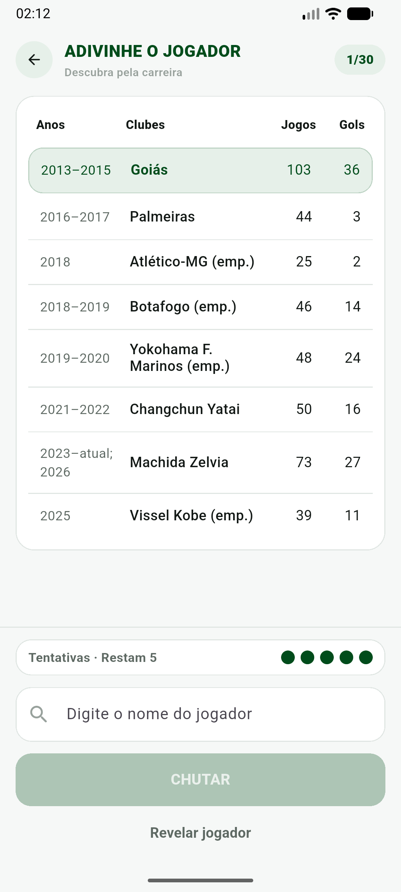
  
</p>
<p align="center">
  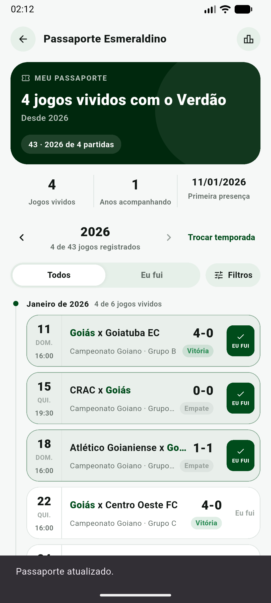
  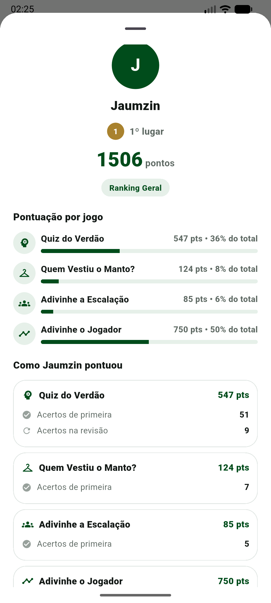
</p>

## O Clube

Hub institucional com a identidade do clube: **História**, **Títulos**, **Diretoria**, **Elenco** (perfil individual de cada jogador, com estatísticas de carreira), **Hino & Músicas**, **Transparência** (balanços, atas e demonstrativos) e **Parceiros**.

<p align="center">
  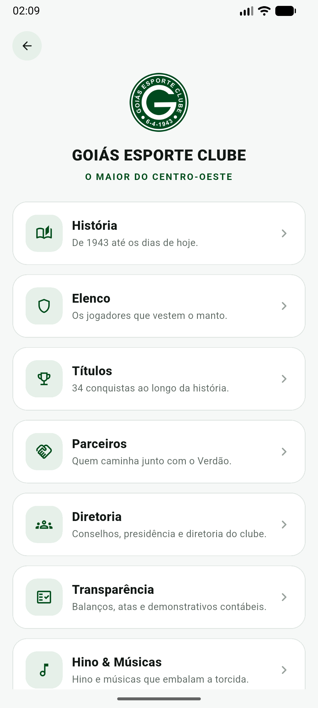
  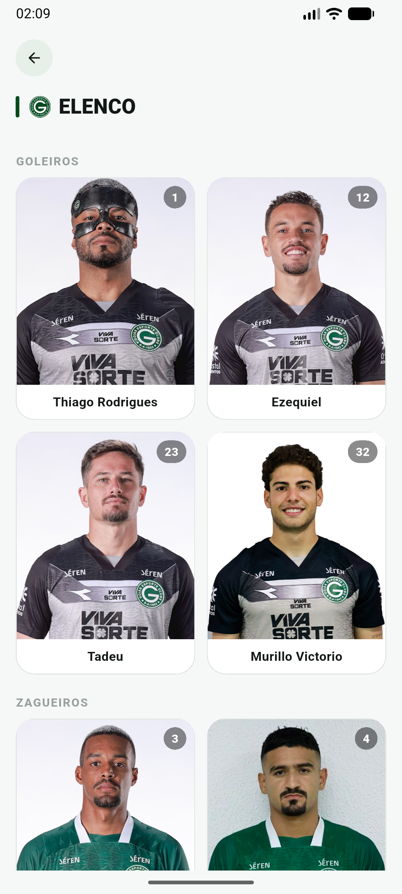
  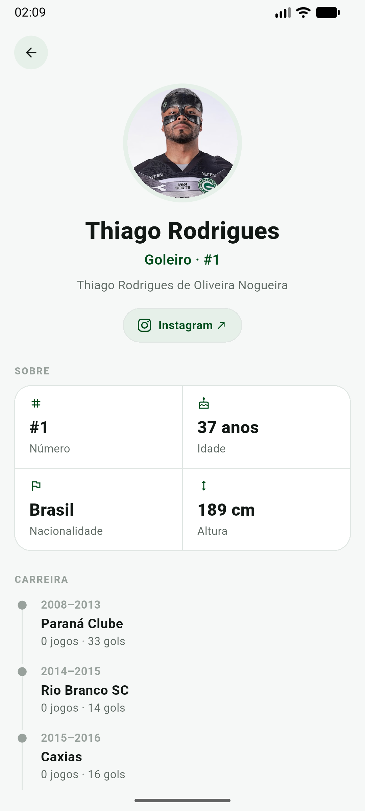
</p>

## Conta e Perfil

- Login, cadastro, recuperação de senha e confirmação de e-mail via Supabase Auth.
- Dados pessoais, endereço, troca de senha e avatar.
- Termos de Uso e Política de Privacidade dentro do app.
- Exclusão de conta (remove a conta e todos os dados vinculados, com dupla confirmação).

<p align="center">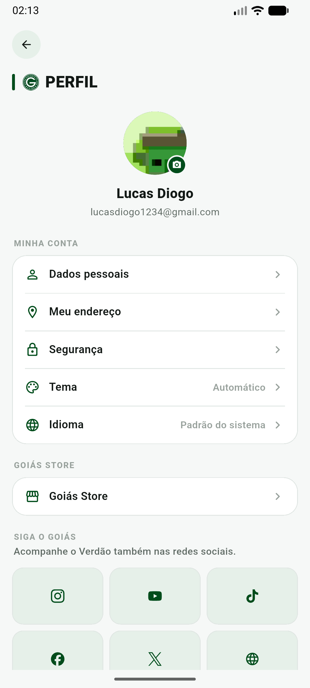</p>

## Idiomas e tema

App inteiro traduzido em **Português, Inglês e Espanhol**, com seletor de idioma independente do idioma do sistema, e tema claro/escuro/automático.

## Arquitetura

Clean Architecture por feature, sem geração de código:

```
lib/
  core/           # DI (get_it), roteamento (go_router), tema, config, network, l10n
  features/
    <feature>/
      domain/       # entidades, contratos de repositório
      data/         # DTOs, datasources, implementações (reais e mock)
      presentation/ # Cubits (flutter_bloc), páginas, widgets
  shared/         # widgets e utilitários reaproveitados entre features
```

- **Estado**: `flutter_bloc` (Cubit) + `equatable`.
- **DI**: `get_it`.
- **Navegação**: `go_router`, com redirecionamento automático baseado no estado de autenticação.
- **Rede**: `dio`/`http`, com repositórios mock e reais atrás da mesma interface — a UI nunca sabe qual está usando.
- **Localização**: `flutter_localizations` + `intl` (`flutter gen-l10n`), arquivos-fonte em `lib/l10n/app_{pt,en,es}.arb`.

## Backend (Cloudflare Worker)

Fica em `src/`, escrito em TypeScript, deployado via `git push` (deploy automático ligado ao repositório).

| Rota | Descrição |
|---|---|
| `GET /api/football/standings` | Classificação da Série B |
| `GET /api/football/current-round` | Jogos da rodada atual |
| `GET /api/football/team/goias` | Próximo jogo e últimos resultados do Goiás |
| `GET /api/football/fixtures/:id` | Detalhes de uma partida |
| `GET /api/social/feed` | Feed social unificado (Instagram + X + YouTube) |
| `GET /api/news` / `GET /api/news/:id` | Lista e detalhe de notícias |
| `GET /api/image-proxy` | Proxy de imagens externas (contorna CORS) |

Fonte esportiva única: **OneFootball** (endpoint interno da própria página, sem key nem secret), cobrindo próximo jogo, rodada atual, detalhe de partida e classificação. Respostas cacheadas por endpoint, com `CACHE_VERSION` em `wrangler.toml` pra invalidar o cache quando o formato mudar.

O Instagram é sincronizado 3x/dia por um **Cron Trigger** do próprio Worker, que dispara uma Task do Apify e grava o resultado num namespace do Workers KV — nenhuma abertura do app dispara a sincronização.

## Backend (Supabase)

Auth (e-mail + senha) e todo o conteúdo/estado que precisa persistir entre sessões e dispositivos: Sócio Esmeralda, Ingressos, Elenco, Diretoria, Transparência, e o conteúdo + progresso + ranking de toda a Arena Esmeraldina (Quiz, Escalação da Torcida, Adivinhe a Escalação, Adivinhe o Jogador, Quem Vestiu o Manto?, Passaporte Esmeraldino). Migrações e seeds em `supabase/`.

## Rodando o projeto

### App Flutter

```bash
flutter pub get
flutter run
```

A configuração do Supabase já vem com valores padrão embutidos (`lib/core/config/supabase_config.dart`); para apontar para outro projeto, sobrescreva via `--dart-define`:

```bash
flutter run --dart-define=SUPABASE_URL=... --dart-define=SUPABASE_PUBLISHABLE_KEY=...
```

### Worker (Cloudflare)

```bash
npm install
npm run dev:worker   # ambiente local
npm run deploy       # deploy manual, se precisar
```

Na prática o deploy é automático a cada `git push` para a branch principal — normalmente não é preciso rodar `wrangler deploy` manualmente.

## Testes e qualidade

```bash
flutter analyze
flutter test
```

```bash
npm run test:worker   # testes do Worker (Vitest)
```
