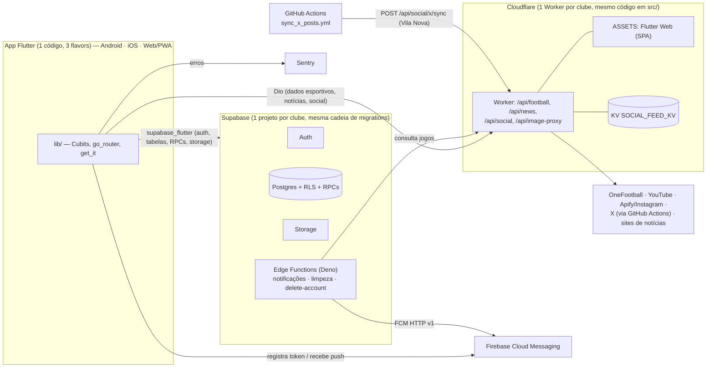

# Visão geral da arquitetura

> Escopo: análise **estática** do repositório no commit `e90de17` (2026-10-02). Nada foi executado contra bancos ou serviços reais. Onde algo não foi confirmado no código, o texto diz **NÃO VERIFICADO**. Veja o [README](README.md) para o método e as limitações.

## 1. O que é o `fan-hub`

App Flutter **multi-clube** para torcedores, publicado em três "sabores" (flavors) a partir de uma única base de código:

| Clube | Código (`APP_CLUB`) | Observação |
|---|---|---|
| Goiás EC | `goias` | Clube original; é o fallback quando `APP_CLUB` vem vazio |
| RB Bragantino | `bragantino` | Sem ingressos e sem escalação da torcida |
| Vila Nova FC | `vilanova` | Sem loja e sem escalação da torcida |

O pacote Dart ainda se chama `goias_app` e a classe raiz `GoiasApp`, por herança histórica (ver [technical-debt.md](technical-debt.md)).

## 2. Contexto do sistema



Pontos que definem a arquitetura:

- **Isolamento físico por clube.** Há um projeto Supabase, um Worker e (no Android/iOS) um flavor por clube. O `club_id` nas tabelas é identidade canônica/defensiva, **não** o mecanismo de isolamento. Detalhes em [multi-club.md](multi-club.md).
- **Duas fontes de dados no app.** Dados esportivos, notícias e feed social vêm do **Worker** (via Dio, sem autenticação); dados do usuário e conteúdo do clube vêm do **Supabase** (com sessão).
- **Sem tempo real push no cliente.** Não há Supabase Realtime; partida ao vivo é *polling* de 45 s no app e cron de 1 min no servidor para notificações.
- **Comércio em modo demo.** Ingressos e loja usam repositórios `Mock*` sem gateway de pagamento; pedidos e check-ins do usuário **são persistidos** no Supabase.

## 3. Stack

| Camada | Tecnologia (verificada em `pubspec.yaml` / `package.json`) |
|---|---|
| App | Flutter 3.44.1 (`.fvmrc`), Dart `^3.12.1` |
| Estado | `flutter_bloc` ^9 (somente Cubits) + `equatable` |
| DI | `get_it` (service locator manual, sem codegen) |
| Navegação | `go_router` ^18 |
| Rede | `dio` (Worker) · `supabase_flutter` ^2.17 (Supabase) com `SessionAwareHttpClient` |
| Push | `firebase_core` + `firebase_messaging` (sem Firebase Auth) |
| Observabilidade | `sentry_flutter` / `sentry_dio` 9.28 |
| Jogos | `flame` (apenas o Penalty) |
| Backend de dados | Supabase Postgres (RLS, RPCs `SECURITY DEFINER`), Edge Functions Deno |
| Backend de borda | Cloudflare Worker em TypeScript (`wrangler`, `vitest`) |
| Ferramentas | Node (`tooling/`, `scripts/`, `tool/`) e Python (scraping/ícones) |

## 4. Mapa do repositório

| Pasta | Conteúdo |
|---|---|
| `lib/` | App Flutter (ver §5) |
| `test/` | Testes Dart (ver [testing-overview.md](testing-overview.md)) |
| `src/` | Worker Cloudflare: `football/`, `news/`, `social/`, `media/` |
| `supabase/` | `migrations/` (cadeia oficial), `functions/` (Edge), e ~114 `.sql` soltos (referência histórica e seeds por clube) |
| `infra/supabase/clubs/` | `bootstrap.sql` por clube (insere a linha do clube em `public.clubs`) |
| `tooling/` | Pipelines de dados e auditorias (`multiclub/` é o maior) |
| `scripts/`, `tool/` | Geração de SQL/ícones/splash; build web por flavor; calibrações dos jogos de identidade |
| `android/`, `ios/`, `web/` | Shells nativos e web, com flavors |
| `docs/` | Documentação (`multiclub/` tem ~60 relatórios de etapas) |
| `archive/` | 63 migrations legadas do Goiás (não são `workdir` do CLI) |
| `data_export/` | Artefatos gerados a partir dos seeds (JSON) |
| `assets/`, `assets_gen/`, `design_refs/` | Imagens, fontes/ícones gerados, referências de design |
| `rb_bragantino_partners/`, `_competitions_pkg/` | Utilitários/pacotes auxiliares (propósito detalhado **NÃO VERIFICADO**) |

## 5. Organização do app (`lib/`)

```
lib/
├─ main.dart            # único entrypoint
├─ core/                # infraestrutura transversal
│  ├─ club/             # ClubConfig, registro, capabilities, gate de rotas
│  ├─ config/           # Supabase e Sentry
│  ├─ di/               # injection_container.dart (get_it)
│  ├─ error/            # Failure, Result<T>
│  ├─ l10n/ theme/ network/ release/ router/ session/ mock/
├─ features/<feature>/  # 18 features, cada uma presentation/ domain/ data/
├─ shared/              # widgets, utils, validação, LoadStatus
└─ l10n/                # app_pt/en/es.arb + classes geradas
```

As **18 features** estão em [feature-map.md](feature-map.md). O padrão é `presentation` (cubit/pages/widgets) + `domain` (entidades, contratos de repositório) + `data` (implementações Supabase/Dio, DTOs, catálogos locais). Desvios: `home`, `splash` e `release_gate` só têm `presentation`; `arena` tem sub-features por jogo; `passport` mantém duas variantes de UI (v1 e v2, escolhida por constante de compilação).

### Camadas do grafo de conhecimento

O grafo (`.ua/knowledge-graph.json`) classifica os 1.439 arquivos de nível de arquivo em 10 camadas, atribuídas **por regras de caminho**:

| Camada | Arquivos |
|---|---:|
| Apresentação das Features | 375 |
| Testes | 207 |
| Tooling e Scripts | 178 |
| Banco de Dados Supabase | 127 |
| Domínio das Features | 122 |
| Core e Shared | 104 |
| Dados das Features | 100 |
| Plataformas, CI e Configuração | 87 |
| Documentação | 76 |
| Backend Edge e Workers | 63 |

(Os `src/**/*.test.ts` foram realocados de Backend para Testes depois da revisão do grafo.)

## 6. Estado, DI, erros, rede, cache

- **Estado:** somente **Cubits**, com `LoadStatus` e `copyWith`. Cubits globais (`AuthCubit`, `ThemeCubit`, `LocaleCubit`, `CartCubit`, `MembershipStatusCubit`) são singletons do `get_it` providos com `BlocProvider.value` em `GoiasApp`; a maioria dos demais é `registerFactory`; os dos jogos e fluxos de compra são criados na própria página e passados via `state.extra`.
- **DI:** `lib/core/di/injection_container.dart` (`final sl`). O primeiro registro é `ClubConfig` (`resolveActiveClub()`); repositórios são `registerLazySingleton` por contrato de domínio. `sl<T>()` também é usado **diretamente em páginas e no router** (service locator, não só composição).
- **Erros:** repositórios devolvem `Result<T>` (`Success`/`Error(Failure)`), com mappers por feature. Sentry via `SentryFlutter.init`, `SentryNavigatorObserver` e `dio.addSentry()` (`sendDefaultPii=false`).
- **Rede:** *Dio* só para o Worker (timeouts de 10 s, sempre envia `club=<code>`); *Supabase* com `SessionAwareHttpClient`, que renova o JWT e repete a requisição **uma vez** em caso de 401 `PGRST303`/"jwt expired".
- **Cache/persistência:** `SharedPreferences` com chaves escopadas por clube (`<club>:<chave>`); caches em memória pontuais. **Sem modo offline** (sem banco local nem fila de escrita).
- **Tempo real:** nenhum canal Realtime; *polling* de 45 s (`MatchDetailsCubit`, `LiveMatchPoller`).
- **Push:** `PushNotificationService` liga ao `AuthCubit` (registra/desativa token em `user_notification_tokens`); *background handler* é vazio; Web Push **não** implementado.
- **Release gate:** `ReleaseGate` lê `app_release_requirements` (timeout 3 s); falha ou timeout **não bloqueia** (*fail-open*).
- **i18n/tema:** `pt` (template), `en`, `es`; Material 3 com cores do clube em `ThemeExtension`.

## 7. Arquivos mais centrais

Por *fan-in* de imports **entre arquivos de produção** (`lib/`; imports vindos de `test/` não entram), calculado sobre as arestas `imports` do grafo:

| Arquivo | Dependentes diretos | Blast radius* |
|---|---:|---:|
| `lib/core/theme/app_colors.dart` | 223 | 387 |
| `lib/core/theme/app_spacing.dart` | 201 | 273 |
| `lib/core/l10n/l10n_extensions.dart` | 190 | 275 |
| `lib/core/club/club_config.dart` | 146 | 296 |
| `lib/core/di/injection_container.dart` | 132 | 201 |
| `lib/shared/state/load_status.dart` | 108 | 275 |
| `lib/core/error/result.dart` | 90 | 277 |

\* dependentes transitivos, também só de produção. Análise completa em [technical-debt.md](technical-debt.md) §6.

Por papel arquitetural: `lib/main.dart` (boot), `club_config.dart` + `*_club_config.dart` (multi-clube), `injection_container.dart`, `app_router.dart` (852 linhas), `capability_route_gate.dart`, `auth_cubit.dart`, `session_aware_http_client.dart` e `push_notification_service.dart`.

## 8. Plataformas

- **Android:** flavors Gradle (`goias`, `bragantino`, `vilanova`) com `google-services.json` por flavor; release exige `android/key.properties`.
- **iOS:** schemes e `xcconfig` por flavor; `Info.plist` com `remote-notification`.
- **Web/PWA:** `tool/build_web_flavor.mjs <clube>` gera `build/flavors/web/<clube>`, servido pelo Worker como assets (SPA). Firebase/FCM desligados no web.

Detalhes de build em [multi-club.md](multi-club.md) e integrações em [backend-integrations.md](backend-integrations.md).
