# Backend e integrações

> Fonte: baseline e migrations em `supabase/`, `supabase/functions/`, `src/`, `wrangler*.toml`, repositórios em `lib/**/data` e `tooling/`. Análise estática: o **estado vivo** dos bancos, o deploy real das Edge Functions e as regras da Cloudflare **não foram verificados**. Identificadores de projeto e segredos não são reproduzidos aqui; consulte `tooling/multiclub/supabase_projects_registry.json` e os `wrangler*.toml`.

## 1. Supabase

### 1.1 Topologia

- **Um projeto Supabase por clube** (goias, bragantino, vilanova), todos marcados `writable` no registry.
- Os três compartilham **uma única cadeia** `supabase/migrations/` (cadeia oficial desde o *cutover* de 2026-09-04). `supabase/config.toml` só aponta o projeto do Goiás e não há `supabase start`/Docker.
- O Flutter conecta ao projeto do flavor via `lib/core/config/supabase_config.dart` (URL e chave *publishable* em `*_club_config.dart`). Não há *fallback* para o Goiás: clube sem URL/chave lança erro.
- Consequência: `club_id` nas tabelas é **identidade canônica** (UUID v5 por clube em `tooling/multiclub/club_registry.mjs`), não o mecanismo de isolamento.

### 1.2 Cadeia de migrations (18 arquivos)

| Migration | Conteúdo |
|---|---|
| `20260904000000_canonical_baseline` | Schema canônico (2.807 linhas): 58 tabelas, 28 funções, 3 triggers, buckets `avatars`/`email-assets`. Gerada por introspecção ao vivo do Goiás (não por *squash*); `clubs` nasce vazia |
| `20260904210000_add_delivery_address_triggers` | Recria os triggers de `delivery_addresses` |
| `20260908000000_squad_members_add_lifecycle_columns` | `active`, `departed_at`, `departed_to` |
| `20260909000000_arena_record_score_identity_games` | Recria `arena_record_score` **legada** (o baseline só tem `_for_club`) com jogos `tactical_identity`/`player_identity` |
| `20260909120000_half_price_proof` | Meia-entrada em `tickets` + bucket privado `half_price_proofs` |
| `20260911000000_live_match_notification_events` | Tipos de evento de push e colunas de preferências |
| `20260915000000_passport_esmeraldino_historical_schema` | Colunas históricas em `passport_matches` + `passport_matches_excluded` |
| `20260930010000` … `20261002030000` (11) | **Somente correções de dados do Goiás** (career_players, altura/pé de jogadores, pesquisas da Arena, regra do "clube formador") |

Observações verificadas:

- `20261002030000_manto_goias_academy_club_rule.sql` está **untracked** no git.
- `supabase/MIGRATIONS.md` está **desatualizado**: referencia `supabase/migrations/20260830220000_baseline_marker.sql`, arquivo que hoje só existe em `archive/`; não menciona o `canonical_baseline` nem os outros dois projetos; trata só o Goiás como PROD.
- `archive/supabase/goias-legacy-migrations/` guarda 63 migrations antigas do Goiás (não é *workdir* do CLI).
- `supabase/*.sql` soltos (114 arquivos) são referência histórica e **seeds por clube** (47 `bragantino_*`, 26 `vilanova_*`, passaportes por ano, elencos, quizzes), mais dois scripts de cron e auditorias. Não são migrations.
- `infra/supabase/clubs/<clube>/bootstrap.sql` insere a linha do clube em `public.clubs` (fora da cadeia).

### 1.3 Como se aplica

| Ferramenta | Função |
|---|---|
| `tooling/multiclub/db-push.mjs <clube> [--dry-run] [--yes]` | `supabase db push` do clube resolvido; exige `<CLUBE>_DB_URL`; valida o *project ref*; `--yes` obrigatório para escrever |
| `tooling/multiclub/run-sql-file.mjs <clube> <arquivo> [--yes]` | Executa um `.sql` inteiro (bootstrap e seeds soltos) via `pg` |
| `query-sql-file.mjs`, `db-status.mjs`, `db_target_resolver.mjs` | Consulta, estado e resolução de alvo (nunca loga o host completo) |
| `audit_*.mjs` / `test_*.mjs` | Auditorias de schema, tenant e baseline |

Connection strings **não** ficam no repositório (variáveis de ambiente ou prompt).

### 1.4 Tabelas (baseline, schema `public`)

**Identidade e configuração:** `clubs`, `app_release_requirements`, `profiles`, `user_addresses`, `delivery_addresses`.

**Cadastro canônico de pessoas e partidas:** `people`, `person_aliases`, `person_alias_sources`, `player_club_spells(+_sources)`, `player_club_stats(+_sources)`, `player_positions(+_sources)`, `player_match_appearances(+_sources)`, `matches`, `match_source_refs`, `venues`.

**Arena:** `quiz_questions`, `quiz_active_session`, `quiz_question_progress`, `guess_players`, `career_players`, `lineup_matches`, `career_path_progress`, `lineup_match_progress`, `arena_selected_content`, `arena_achievements`, `user_game_item_progress`, `player_identity_results`, `tactical_identity_results`, `score_events`, `match_lineup_votes`.

**Passaporte:** `passport_matches`, `passport_attendances`, `passport_memorable_matches`, `passport_sync_runs`, `passport_matches_excluded`.

**Clube, sócio, loja e ingressos:** `club_board_*`, `club_transparency_*`, `membership_faq_*`, `membership_regulation_versions`, `membership_plans`, `supporter_memberships`, `store_orders`, `store_order_items`, `ticket_orders`, `tickets`, `ticket_checkin_decisions`, `squad_members`.

**Push e monitoramento:** `user_notification_tokens`, `user_notification_preferences`, `notification_events`, `notification_deliveries`, `match_monitor_sessions`.

Não há **views** nem uso de **realtime/publications**.

### 1.5 RPCs e triggers

Todas as RPCs de negócio são `SECURITY DEFINER` (as de trigger de endereço são `INVOKER`), com `revoke ... from public` e `grant` explícito.

| Domínio | Funções | Grants |
|---|---|---|
| Arena | `arena_ranking_for_club`, `arena_my_rank_for_club`, `arena_user_detail_for_club`, `arena_record_score_for_club` | `authenticated` |
| Escalação da torcida | `crowd_lineup_for_club` | `authenticated` |
| Sócio | `get_my_membership_for_club`, `subscribe_to_plan_for_club` | `authenticated` |
| Loja | `create_store_order_for_club`, `generate_store_order_number` | `authenticated` |
| Ingressos | `upsert_membership_checkin_ticket_for_club` | `authenticated` |
| Cadastro | `cpf_is_taken` | **`anon`**, `authenticated`, `service_role` |
| Passaporte | 11 funções `passport_*` | **`anon`**, `authenticated`, `service_role` (ver [security-overview.md](security-overview.md)) |
| Limpeza | `list_unconfirmed_signups_for_cleanup` | `service_role` |

Triggers: `on_auth_user_created` (insere em `profiles`), `delivery_addresses_ensure_default`, `delivery_addresses_single_default`. A função `rls_auto_enable()` existe, mas o baseline **não** cria o `EVENT TRIGGER` (**NÃO VERIFICADO** no banco vivo).

### 1.6 RLS e Storage

- **RLS ligada em 100% das tabelas** (58 do baseline conferidas por script mais `passport_matches_excluded`).
- Padrões: leitura pública (`using (true)`) apenas em catálogos; "dono" (`user_id = auth.uid()`) em dados do usuário; "somente service role" em `match_monitor_sessions`, `notification_events`, `notification_deliveries`; RLS **sem policy** (negado a anon/authenticated) em `*_sources`, `match_source_refs`, `passport_sync_runs`, `passport_matches_excluded`.
- Storage: `avatars` (público; escrita só na pasta do próprio usuário), `email-assets` (público, sem policy de escrita), `half_price_proofs` (privado, só o dono). Nenhum bucket define limite de tamanho ou MIME.

### 1.7 Edge Functions (`supabase/functions/`, Deno)

| Função | Gatilho | O que faz |
|---|---|---|
| `notifications-sync-and-check-access` | cron 30 min | Percorre o registry de clubes, consulta o Worker, grava `match_monitor_sessions` e eventos de acesso |
| `notifications-poll-live-match` | cron 1 min | Detecta transições de status da partida e grava `notification_events` |
| `notifications-dispatch` | chamada pelas duas acima + cron 5 min | Lê preferências/tokens/sócios, envia via **FCM HTTP v1**, grava `notification_deliveries` |
| `notifications-test-trigger` | manual | Evento de teste, exige `x-test-secret` |
| `cleanup-unconfirmed-signups` | cron horário | Apaga cadastros não confirmados há mais de 48 h |
| `delete-account` | chamada do Flutter | Identifica o usuário pelo JWT, apaga avatar e usuário |

Chamadas de serviço usam `_shared/service_caller_auth.ts` (`rejectUnlessServiceCaller`). O registro de clubes do servidor (`_shared/club_server_config.ts`) é **duplicado** no Worker (`src/football/_lib/club_server_config.ts`) e no Dart; `audit_multiclub_runtime_hardcodes.mjs` serve para detectar *drift*. As funções iteram os 3 clubes do registry, mas cada projeto só contém o próprio clube; como isso se comporta em execução é **NÃO VERIFICADO**. O agendamento fica em scripts soltos: `notifications_cron.sql` tem *placeholder* de project ref e `cleanup_unconfirmed_signups_cron.sql` tem o ref do Goiás fixo.

## 2. Cloudflare Worker (`src/`)

### 2.1 Deploy

Um Worker por clube, **mesmo código** (`main = src/index.ts`): `goias-app`, `bragantino-app`, `vilanova-app`.

| Item | Goiás | Bragantino | Vila Nova |
|---|---|---|---|
| `CLUB_CODE` | goias | bragantino | vilanova |
| Competição primária | Série B | Brasileirão | Série B |
| `CACHE_VERSION` | 16 | 1 | 1 |
| Cron | 3×/dia | 2×/dia | nenhum (Instagram disparado pelo GitHub Actions) |
| Assets (Flutter Web) | `build/web` | `build/flavors/web/bragantino` | `build/flavors/web/vilanova` |

Bindings: `ASSETS` (SPA com *fallback*) e o KV `SOCIAL_FEED_KV` — o **mesmo namespace nos três**, com chaves prefixadas por clube. Sem D1, R2 ou Durable Objects. Secrets esperados (nomes): `YOUTUBE_API_KEY`, `APIFY_TOKEN`, `INSTAGRAM_SYNC_KEY`, `X_SYNC_KEY`.

### 2.2 Rotas

| Rota | Função | Cache |
|---|---|---|
| `GET /api/football/standings` | classificação | 45 min |
| `GET /api/football/current-round` | rodada | 20 min |
| `GET /api/football/competitions` | competições | não verificado |
| `GET /api/football/team/:clube` e `/season` | time e temporada | 60 s / 20 min |
| `GET /api/football/fixtures/:id` | detalhe da partida (`onef-<n>`) | 60 s |
| `GET /api/social/feed` | feed (YouTube, Instagram, X) | via `cacheFirst` |
| `POST /api/social/instagram/sync`, `/x/sync` | sincronização (header `x-sync-key`) | — |
| `GET /api/news`, `/api/news/:slug` | notícias | 10 / 60 min |
| `GET /api/image-proxy?url=` | proxy com allowlist de hosts | 7 dias |
| qualquer outra | `ASSETS` (Flutter Web) | — |

A chave de cache é a URL mais `__cv=CACHE_VERSION`. `?club=` diferente de `CLUB_CODE` responde 404.

### 2.3 APIs externas

| Origem | Uso |
|---|---|
| OneFootball (sem chave) | partidas, rodadas, classificação, time |
| YouTube Data API v3 | feed social |
| Apify (task do Instagram) | Instagram → KV |
| X via Scweet no GitHub Actions | posts do X (Goiás/Bragantino commitados em JSON, Vila Nova por POST ao Worker) |
| Sites de notícias de cada clube | scraping com parsers por clube |
| ViaCEP e IBGE | direto do app (endereço e localidade) |

## 3. Como o Flutter conversa com cada recurso

| Feature | Recursos |
|---|---|
| `core/release` | tabela `app_release_requirements` |
| `auth` | Supabase Auth, RPC `cpf_is_taken`, Edge `delete-account` |
| `profile` | `profiles`, `user_addresses`, Storage `avatars` |
| `arena` (progresso e ranking) | `arena_achievements`; RPCs `arena_*_for_club` |
| `arena` (jogos) | `quiz_*`, `guess_players`, `career_players`, `career_path_progress`, `lineup_*`, `arena_selected_content`, `player_identity_results`, `tactical_identity_results` |
| `crowd_lineup` | `match_lineup_votes`, RPC `crowd_lineup_for_club` |
| `club` | `club_board_*`, `club_transparency_*` |
| `membership` | `membership_faq_*`, RPCs `get_my_membership_for_club` e `subscribe_to_plan_for_club` |
| `notifications` | `user_notification_tokens`, `user_notification_preferences` + FCM |
| `squad` | `squad_members` |
| `store` | RPC `create_store_order_for_club`, `store_orders`, `delivery_addresses` |
| `ticket` | `tickets`, `ticket_orders`, `ticket_checkin_decisions`, Storage `half_price_proofs`, RPC `upsert_membership_checkin_ticket_for_club` |
| `passport` | 11 RPCs `passport_*` |
| `match`, `news`, `social` | endpoints do Worker via Dio |
| `home`, `partners`, `splash`, `release_gate` | sem acesso direto a tabela encontrado (**não aprofundado**) |

## 4. Firebase, Sentry e CI

- **Firebase:** só `firebase_core` e `firebase_messaging`. Autenticação é Supabase Auth. Há `google-services.json`/`GoogleService-Info.plist` por clube, mas o projeto Firebase é **único** para os três (mesma chave de cliente nos 3 flavors).
- **Sentry:** DSN com valor padrão embutido em `lib/core/config/sentry_config.dart` (sobrescrevível por `--dart-define SENTRY_DSN`); **um único DSN e sem tag de clube**.
- **CI:** apenas `.github/workflows/sync_x_posts.yml` (cron diário + manual: instala Scweet, coleta posts do X, commita JSON em `src/social/data/{goias,bragantino}/` e, para o Vila Nova, faz POST ao Worker). **Não há CI de testes nem de deploy.**

## 5. Modelo de dados (resumo)

```mermaid
erDiagram
  clubs ||--o{ squad_members : club_id
  clubs ||--o{ quiz_questions : club_id
  clubs ||--o{ guess_players : club_id
  clubs ||--o{ career_players : club_id
  clubs ||--o{ lineup_matches : club_id
  clubs ||--o{ membership_plans : club_id
  clubs ||--o{ notification_events : club_id
  clubs ||--o{ match_monitor_sessions : club_id
  people ||--o{ person_aliases : person_id
  people ||--o{ player_club_spells : person_id
  people ||--o{ guess_players : person_id
  people ||--o{ career_players : person_id
  player_club_spells ||--o{ player_club_stats : spell_id
  player_club_spells ||--o{ player_match_appearances : spell_id
  matches ||--o{ player_match_appearances : canonical_match_id
  matches ||--o{ match_source_refs : match_id
  venues ||--o{ passport_matches : venue_id
  passport_matches ||--o{ passport_attendances : match_id
  auth_users ||--|| profiles : id
  auth_users ||--o{ passport_attendances : user_id
  auth_users ||--o{ store_orders : user_id
  store_orders ||--o{ store_order_items : order_id
  auth_users ||--o{ supporter_memberships : user_id
  auth_users ||--o{ tickets : user_id
  auth_users ||--o{ user_notification_tokens : user_id
  notification_events ||--o{ notification_deliveries : event_id
  user_notification_tokens ||--o{ notification_deliveries : token_id
```

Limites do diagrama: nem todas as FKs para `auth.users` foram confirmadas (a leitura listou só as primeiras 60 linhas de FKs) e `supporter_memberships.plan_id` foi tratado como referência lógica. Marque como **NÃO VERIFICADO** antes de usar para decisões de integridade.

## 6. Tooling de dados (`tooling/`)

| Pasta | Produz | Alimenta |
|---|---|---|
| `multiclub/` | registries JSON, geração de seeds/migrations de pessoas/aliases/spells/stats/posições/aparições, auditorias de tenant, deploy | schema canônico e tabelas `people*`, `player_*`, `matches`, `clubs` |
| `bragantino_passport/` | extrai e valida dados do OGol → seeds por ano | `passport_matches`, `venues` (Bragantino) |
| `bragantino_arena/`, `bragantino_lineup/`, `guess_player/` | SQL de `career_players`/`guess_players`, seleção de desafios, auditoria de `photo_key` | Arena |
| `bragantino_store/` | coleta catálogo e assets | loja Flutter |
| `esmeraldino_passport/` | SQL do import histórico do Passaporte do Goiás | `passport_matches*` (Goiás) |
| `vilanova_content/`, `_passport/`, `_membership/`, `_brand/`, `_seeds/` | seeds SQL, Dart institucional, conteúdo de sócio, assets de marca, simulação de projeto novo | Supabase e `lib/` do Vila Nova |
| `passport_security/` | teste IDOR autenticado das RPCs do passaporte | verificação de segurança |
| `regulation/` | `generate_regulation_dart.dart` | regulamento no app |

Também: `scripts/` (geração de SQL de Arena/lineup/membership, import da loja, ícones), `rb_bragantino_partners/`, `data_export/goias` e os relatórios de etapa em `docs/multiclub/`.
