# Fluxos de dados e de execução

> Cada diagrama foi rastreado no código pela auditoria e conferido por amostragem (ver [README](README.md)). Quando um trecho não foi lido, aparece **NÃO VERIFICADO**. Os diagramas são Mermaid; caminhos são relativos à raiz do repositório.

## Índice
1. [Inicialização](#1-inicialização)
2. [Autenticação](#2-autenticação)
3. [Home](#3-home)
4. [Partidas e partida ao vivo](#4-partidas-e-partida-ao-vivo)
5. [Elenco](#5-elenco)
6. [Notificações push (app + servidor)](#6-notificações-push)
7. [Arena e ranking](#7-arena-e-ranking)
8. [Sócio torcedor](#8-sócio-torcedor)
9. [Ingressos e check-in](#9-ingressos-e-check-in)
10. [Loja e pedidos](#10-loja-e-pedidos)
11. [Passaporte](#11-passaporte)
12. [Entradas por link](#12-entradas-por-link)
13. [Pipeline de conteúdo e dados](#13-pipeline-de-conteúdo-e-dados)
14. [Build e deploy por clube](#14-build-e-deploy-por-clube)

---

## 1. Inicialização

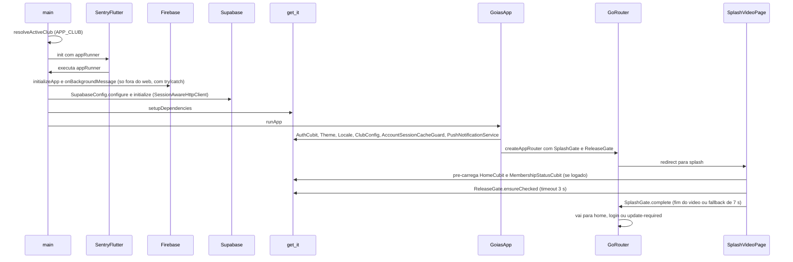

Regras relevantes: `APP_CLUB` vazio resolve para Goiás; valor desconhecido lança `StateError` (*fail-fast*). `SupabaseConfig.configure` lança `StateError` se o clube não tiver URL/chave — **nunca** cai no Goiás.

Arquivos: `lib/main.dart`, `lib/core/club/resolve_active_club.dart`, `lib/core/config/{supabase,sentry}_config.dart`, `lib/core/di/injection_container.dart`, `lib/core/router/{app_router,splash_gate}.dart`, `lib/core/release/release_gate.dart`, `lib/features/splash/presentation/pages/splash_video_page.dart`, `lib/core/network/session_aware_http_client.dart`.

## 2. Autenticação

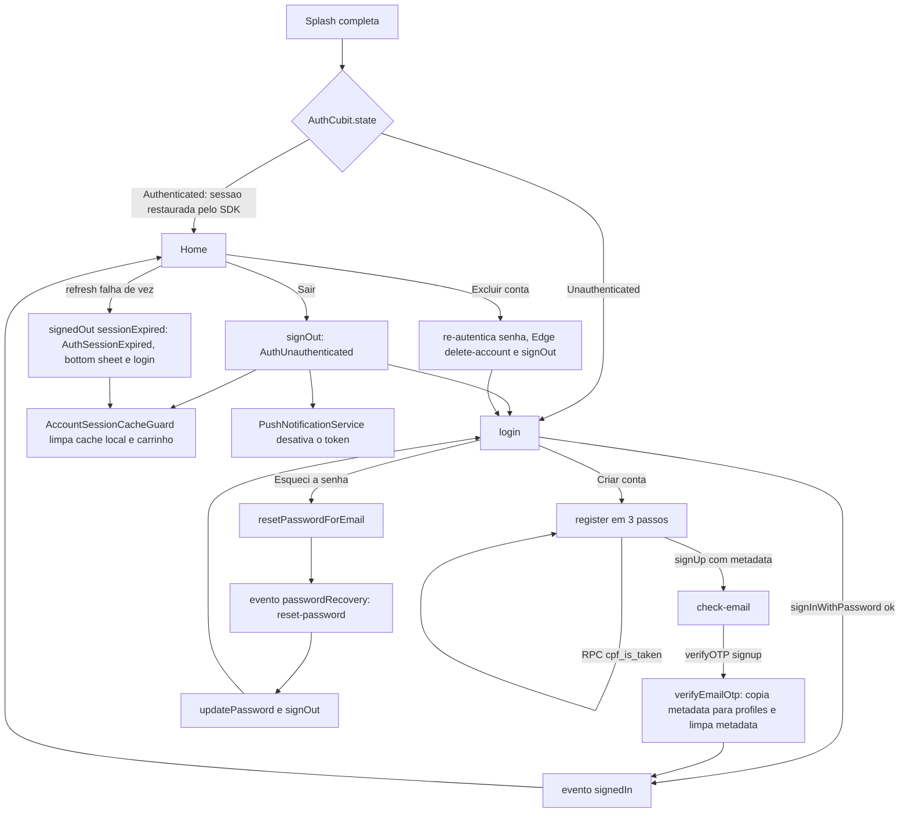

Notas: o cadastro pendente **não** é retomado; a limpeza de cadastros não confirmados é server-side (`supabase/functions/cleanup-unconfirmed-signups`, cron horário). A exclusão de conta identifica o usuário só pelo JWT. A persistência da sessão usa o padrão do `supabase_flutter` (storage customizado **NÃO VERIFICADO**).

Arquivos: `features/auth/data/{auth_remote_data_source,auth_repository_impl,auth_error_mapper}.dart`, `features/auth/presentation/cubit/{auth_cubit,register_cubit}.dart`, `lib/core/session/*`, `lib/shared/widgets/{session_expiry_listener,session_expired_sheet}.dart`, `supabase/functions/{delete-account,cleanup-unconfirmed-signups}/index.ts`.

## 3. Home

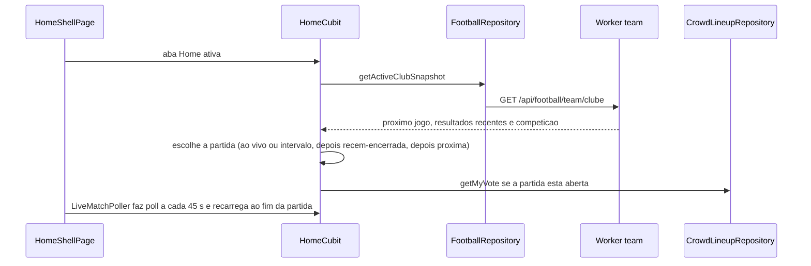

Arquivos: `features/home/presentation/{pages/home_shell_page,pages/home_page,cubit/home_cubit}.dart`, `features/match/data/**`, `features/match/presentation/widgets/live_match_poller.dart`.

## 4. Partidas e partida ao vivo

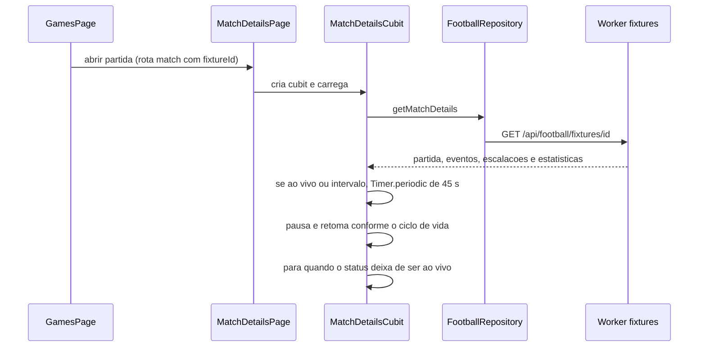

Rotas relacionadas: `/games/competitions` e `/games/competitions/:id` (classificação e mata-mata via `/api/football/standings`). Arquivos: `features/match/presentation/{cubit/match_details_cubit,pages/match_details_page,pages/games_page}.dart`, `src/football/*.ts`.

## 5. Elenco

`SquadListPage` (`/squad`, `SquadCubit` por factory) → `SupabaseSquadRepository` (tabela `squad_members`) → `/squad/:memberId`, que recebe o `SquadMember` por `state.extra`. A rota nunca é gateada por capability. O detalhe das *queries* é **NÃO VERIFICADO**.

## 6. Notificações push

### 6.1 No app

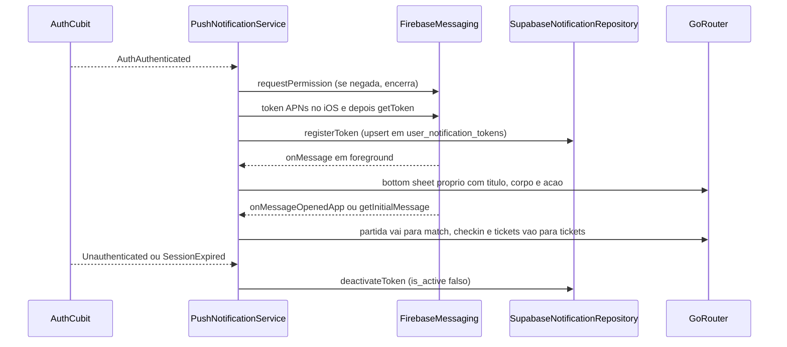

### 6.2 No servidor (Edge Functions + Worker)

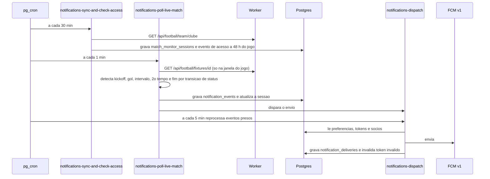

O push **não** sai do Worker; o Worker só serve dados à Edge Function. Todas as funções do pipeline usam `rejectUnlessServiceCaller`. O app só trata rotas de partida e de ingressos; background handler é vazio.

## 7. Arena e ranking

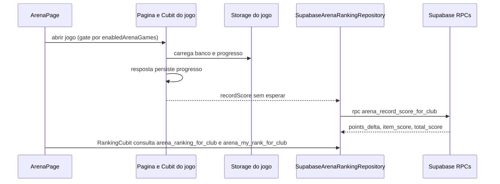

`recordScore` é chamado pelos cubits de quiz, career_path, guess_player e lineup, e pelas páginas de resultado de player_identity e tactical_identity. O **Penalty não pontua**. A pontuação é calculada no servidor, mas parâmetros como `p_event_type` e `p_attempt_number` são declarados pelo cliente (ver [security-overview.md](security-overview.md), S-05).

## 8. Sócio torcedor

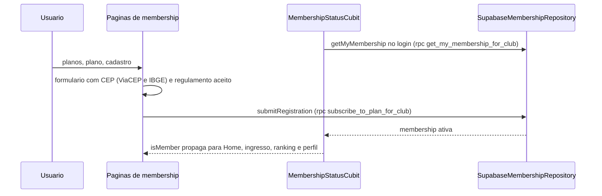

Os planos **não** vêm do servidor (`ClubConfig.membershipProgram.plans`); `checkIn` do repositório de membership é *stub*; modo de comércio `demo`.

## 9. Ingressos e check-in

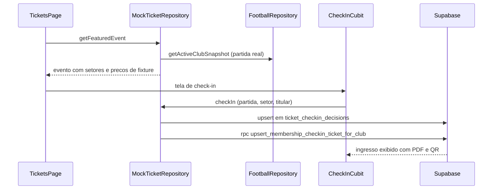

A compra insere em `tickets`/`ticket_orders` direto do app, sem gateway. Disponível em Goiás e Vila Nova. Observação de clube: o QR do PDF usa o prefixo fixo `GOIAS-EC-` (`DEMO-GOIAS-EC-` em modo demo, que é o modo de todos os clubes hoje) — ver [multi-club.md](multi-club.md).

## 10. Loja e pedidos

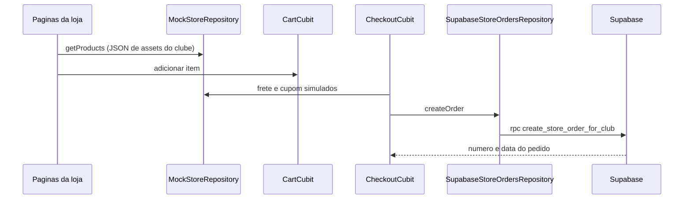

Existe um ramo local acima da RPC cuja condição **NÃO foi verificada**. Loja desabilitada no Vila Nova.

## 11. Passaporte

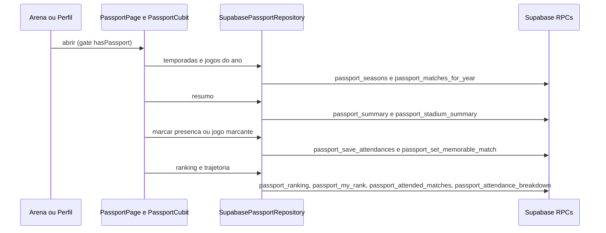

São 11 RPCs `passport_*`. Atenção a segurança: ver S-01 em [security-overview.md](security-overview.md).

## 12. Entradas por link

Não há deep link nativo. As entradas por link são: (a) **web**, onde a URL é a rota `go_router`; (b) **push**, via `_navigate`; (c) **e-mail** de reset/confirmação, via `SupabaseConfig.redirectUrl`. Detalhes em [navigation.md](navigation.md).

## 13. Pipeline de conteúdo e dados

O conteúdo canônico (pessoas, partidas, passagens de jogadores, passaportes históricos, elencos, quizzes) **não** nasce no app: é gerado por scripts em `tooling/`, vira SQL e é aplicado em cada projeto Supabase.

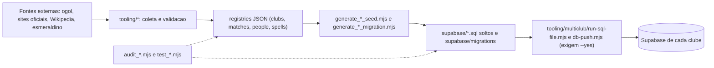

- `db-push.mjs <clube>` aplica **somente** `supabase/migrations/`; seeds soltos vão por `run-sql-file.mjs`. Ambos validam o *project ref* contra `tooling/multiclub/supabase_projects_registry.json` e exigem `--yes` para escrever.
- Cada pasta de `tooling/` e o que ela alimenta está descrita em [backend-integrations.md](backend-integrations.md) §6.
- Cuidado conhecido: as migrations de correção de dados do Goiás (`20260930…` a `20261002…`) estão na **mesma** cadeia aplicada a todos os clubes (ver [technical-debt.md](technical-debt.md)).

## 14. Build e deploy por clube

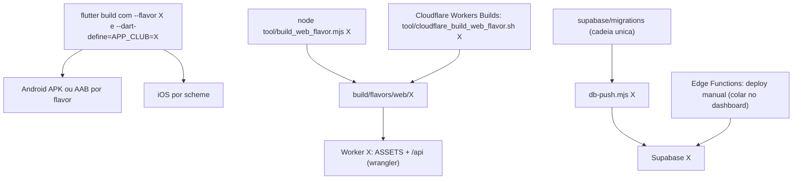

Não existe CI de testes nem de deploy no repositório; o único workflow é `.github/workflows/sync_x_posts.yml`. O deploy das Edge Functions é manual, segundo comentários nos próprios arquivos.
