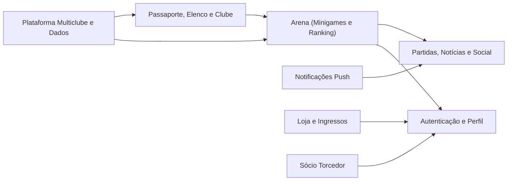

# Mapa de domínios

> Gerado a partir do grafo de domínio (`.ua/domain-graph.json`: **8 domínios, 18 fluxos, 61 passos**), complementado pelas auditorias de arquitetura e backend. **Limitação:** o grafo de domínio foi derivado só de nomes e resumos do grafo de conhecimento (o código-fonte não foi aberto), então os passos são curtos e as arestas entre domínios são genéricas. Onde este documento acrescenta algo além do grafo, isso vem das auditorias e está indicado.
>
> Para abrir de forma interativa: `/understand-dashboard` (veja o [README](README.md)).

## 1. Visão

Cada seta é uma interação registrada no grafo (`cross_domain`). As relações reais são mais densas: por exemplo, o sócio influencia ingressos, ranking e perfil (`MembershipStatusCubit` propaga `isMember`), e quase tudo depende da sessão de `AuthCubit`.

## 2. Domínios

### 2.1 Arena (Minigames e Ranking)
Quiz, adivinhe o jogador, escalação, carreira, identidade de jogador e identidade tática, mais o ranking por clube.

| Fluxo | Passos (arquivos principais) |
|---|---|
| Jogar Quiz | `quiz_question_repository` → `quiz_cubit` → `quiz_progress_repository` → `arena_progress_repository` |
| Adivinhar Jogador | `guess_player_repository` → `guess_player_cubit` |
| Montar Escalação | `lineup_match_repository` → `formation_layout_service` → `word_evaluation_service` → `lineup_cubit` |
| Consultar Ranking | `supabase_arena_ranking_repository` → `ranking_cubit` |

Complementos (auditorias): `career_path`, `player_identity` e `tactical_identity` seguem o mesmo padrão; o **Penalty** (Flame) existe como rota, está oculto no catálogo e **não pontua**. A pontuação vem da RPC `arena_record_score_for_club`. Backend: tabelas `quiz_*`, `guess_players`, `career_players`, `lineup_*`, `arena_*`, `score_events`.

### 2.2 Autenticação e Perfil
| Fluxo | Passos |
|---|---|
| Cadastro e Login | `register_cubit` → `auth_cubit` → `auth_repository` |
| Editar Perfil e Endereço | `profile_cubit` → `address_cubit` → `supabase_profile_repository` |

Complemento: recuperação de senha por OTP/link, exclusão de conta por Edge Function e limpeza de cache em logout (`AccountSessionCacheGuard`). Detalhes em [data-flow.md](data-flow.md) §2.

### 2.3 Partidas, Notícias e Social
Servido pelo **Cloudflare Worker**, não pelo Supabase.

| Fluxo | Passos |
|---|---|
| Acompanhar Partida | `onefootball_provider` → `normalize/match` → `fixtureDetails` (Worker) → `games_cubit` → `match_details_cubit` (app) |
| Ler Notícias | `scraper` → parsers por clube → `list` (Worker) → `news_cubit` |
| Feed Social | `instagram_sync` + `x_sync` → `feed` (Worker) → `social_feed_cubit` |

### 2.4 Notificações Push
| Fluxo | Passos |
|---|---|
| Registrar Dispositivo e Preferências | `push_notification_service` → `supabase_notification_repository` → `notification_preferences_cubit` |

Complemento: o **envio** acontece nas Edge Functions `notifications-*` (cron), não no app nem no Worker. Veja [data-flow.md](data-flow.md) §6.

### 2.4b Loja e Ingressos
| Fluxo | Passos |
|---|---|
| Comprar na Loja | `store_catalog_cubit` → `product_detail_cubit` → `cart_cubit` → `checkout_cubit` → `supabase_store_orders_repository` |
| Comprar Ingresso e Check-in | `tickets_cubit` → `purchase_cubit` → `my_tickets_cubit` → `check_in_cubit` |

Complemento: catálogo e fixtures são **mock**; pedidos e check-ins são persistidos no Supabase ([feature-map.md](feature-map.md) §3).

### 2.5 Sócio Torcedor
| Fluxo | Passos |
|---|---|
| Tornar-se Sócio | `membership_cubit` → `viacep_address_repository` → `membership_registration_cubit` → `membership_status_cubit` |

Complemento: os planos vêm de `ClubConfig.membershipProgram`, não do servidor.

### 2.6 Passaporte, Elenco e Clube
| Fluxo | Passos |
|---|---|
| Consultar Passaporte | `supabase_passport_repository` → `passport_cubit` → `passport_trajectory_cubit` → `passport_ranking_cubit` |
| Escalação da Torcida | `supabase_crowd_lineup_repository` → `crowd_lineup_cubit` (só Goiás) |
| Consultar Elenco | `supabase_squad_repository` → `squad_cubit` |

### 2.7 Plataforma Multiclube e Dados
| Fluxo | Passos |
|---|---|
| Carga de Dados Canônicos | `club_registry` → `generate_people_seed` → `generate_matches_seed` → `db-push` → `audit_multiclub_data_scope` |
| Bloqueio por Versão Obsoleta | `update_required_page` (lógica em `core/release`) |

Complementos: seleção de clube e capabilities ([multi-club.md](multi-club.md)) e o pipeline de dados ([data-flow.md](data-flow.md) §13).

## 3. Termos do negócio (glossário)

| Termo | Significado no código |
|---|---|
| Flavor / clube ativo | Uma das três configurações de `ClubConfig`, escolhida por `APP_CLUB` |
| Capability | Flag em `ClubCapabilities` que liga/desliga uma feature por clube |
| Modo `demo` | `CommerceMode` em que loja/ingressos/sócio não têm pagamento real |
| Arena | Hub de minijogos e ranking do torcedor |
| Passaporte | Registro de jogos assistidos presencialmente, com ranking e trajetória |
| Sócio | Programa de sócio-torcedor do clube (planos e regulamento) |
| Check-in | Confirmação de presença/ingresso de sócio em jogo |
| Quem Vestiu o Manto? | Título do jogo `guess_player` da Arena (`arenaGuessPlayerTitle`); as migrations `manto_goias_*` corrigem seus dados (`guess_players`) |
| Release gate | Bloqueio por versão mínima (atualização obrigatória) |
| Spell | Passagem de uma pessoa por um clube (`player_club_spells`) |
