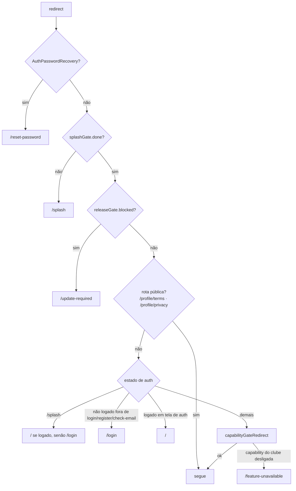

# Navegação

> Fonte principal: `lib/core/router/app_router.dart` (852 linhas), `splash_gate.dart`, `lib/core/club/capability_route_gate.dart`, `lib/core/release/release_gate.dart` e `features/home/presentation/pages/home_shell_page.dart`. Pacote: `go_router` ^18.

## 1. Estrutura geral

`createAppRouter(authCubit, splashGate, releaseGate)` cria um único `GoRouter` com `initialLocation: '/'`. O router reavalia o `redirect` quando muda qualquer um de três *listenables* (`AuthCubit.stream`, `SplashGate`, `ReleaseGate`). Observers: `appRouteObserver` e `SentryNavigatorObserver`.

Existem **dois mecanismos** de navegação, e é importante não confundi-los:

1. **Abas da Home (`/`)** — `HomeShellPage` renderiza um `IndexedStack` de 5 abas controlado por `HomeShellCubit`: `GamesPage`, `MembershipHomePage` ou `ClubPage`, `HomePage`, `StoreHomePage` ou `ArenaPage`, `SocialFeedPage`. Várias abas dependem de capability do clube, então a **composição das abas muda por flavor**.
2. **Rotas `go_router`** — 87 `GoRoute` (contagem em `app_router.dart`), quase todas dentro de um único `ShellRoute` (`DesktopShellFrame`), que só mostra *rail* lateral em telas largas (desktop/web); no mobile é um *no-op*.

## 2. Ordem do `redirect`

Avaliada de cima para baixo (`app_router.dart`, ~linhas 155–199):

Consequências:

- O *release gate* bloqueia **antes** do login (atualização obrigatória vale para qualquer usuário).
- O gate de capability roda **por último**, então cobre também URL direta e *deep link* web de uma feature que o clube não tem.
- O `ReleaseGate` é *fail-open*: erro ou *timeout* de 3 s não bloqueia o app.

## 3. Rotas (resumo)

**Fora do shell:** `/splash`, `/`, `/update-required`, `/feature-unavailable`, `/profile/terms`, `/profile/privacy`, `/arena/penalty`, `/login`, `/register`, `/check-email`, `/reset-password`.

**Dentro do `ShellRoute`:**

| Grupo | Rotas |
|---|---|
| Partidas | `/match/:fixtureId`, `/games/competitions[/:id]`, `/crowd-lineup` |
| Perfil | `/profile` + `personal`, `address`, `security`, `delete-account`, `theme`, `language`, `notifications` |
| Elenco | `/squad[/:memberId]` |
| Ingressos | `/tickets` + `my`, `orders`, `checkin`, `view`, `purchase`, `purchase/summary`, `purchase/info` |
| Arena | `/arena` + `ranking`, `quiz[/play\|/result]`, `lineup`, `career-path`, `guess-player`, `tactical-identity[...]`, `player-identity[...]`, `penalty/result`, `passport[/ranking\|/trajectory[/matches\|/counts]]` |
| Clube | `/clube` + `historia`, `titulos`, `idolos[/detalhe]`, `diretoria`, `transparencia[/documento]`, `hino[/letra]` |
| Notícias | `/news[/article\|/pdf]` |
| Sócio | `/membership/` + `plans[/:planId]`, `register`, `regulation`, `find-zip-code`, `faq`, `my`, `coming-soon` |
| Loja | `/store/` + `search`, `category/:categoryId`, `product/:id`, `cart`, `checkout`, `orders[/:id]`, `addresses` |
| Outros | `/partners`, `/coming-soon` |

## 4. Entradas por link e deep links

- **Não há deep link nativo configurado.** O `AndroidManifest.xml` só tem o *intent-filter* `MAIN/LAUNCHER`; o iOS não declara `associated-domains` nem URL schemes. O pacote `app_links` existe apenas como dependência **transitiva** do `supabase_flutter` (confirmado em `pubspec.lock`), sem esquema registrado.
- **Web:** a URL é a rota `go_router`; passa pelo `redirect` completo (splash → release → auth → capability).
- **Push:** `PushNotificationService._navigate` leva tipos de partida para `/match/{matchId}` e `checkin`/`tickets` para `/tickets`; um tipo desconhecido **não navega**.
- **E-mails de confirmação/reset:** usam `SupabaseConfig.redirectUrl` (web do clube); o comportamento em app nativo é **NÃO VERIFICADO**.

## 5. Risco: rotas dependentes de `state.extra`

Muitas telas recebem objetos ou cubits por `state.extra` (por exemplo `/squad/:memberId`, `/store/orders/:id`, `/crowd-lineup`, `/arena/quiz/play`, `/tickets/checkin`). O router tem 41 referências a `state.extra`, das quais **24 com `!`** (por exemplo `app_router.dart:301`, `:324`, `:346`, `:352`, `:435`, `:483`). Efeito prático: **recarregar a página no web ou abrir a URL diretamente quebra** essas telas (`extra` nulo). Isso não aparece em navegação normal dentro do app.

## 6. Service locator no router

O router e várias páginas chamam `sl<T>()` diretamente (por exemplo `app_router.dart:194`, `splash_video_page.dart`, `home_page.dart`). A navegação, portanto, depende do `get_it` já configurado em `setupDependencies()`, executado em `main.dart` depois de `Supabase.initialize`.
